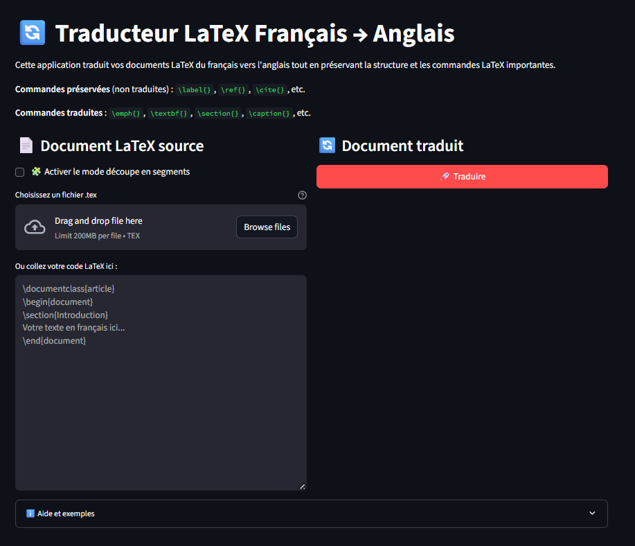

# A french to english LaTeX translator

## Introduction
This Streamlit app translates a LaTeX document from french to english. It can use Groq or OpenAI large language models (LLMs). It takes a latex content on the left pane and prints the translated content on the right pane.

## Why is it useful?
Of course, there is already a set of online tools for translation:
https://translate.google.com/
https://www.deepl.com/
https://www.systransoft.com/
https://www.bing.com/translator
https://www.reverso.net/traduction-texte
https://papago.naver.com/
https://translate.yandex.com/
https://www.online-translator.com/traduction
https://libretranslate.com/
https://www.apertium.org/index.fra.html
https://textsynth.com/translation.html

But none of these tools know about LaTeX out of the box. Moreover, these tools are various limitations including the number of translations that can be performed, the length of each document, etc. For example, textsynth.com uses the MADLAD400 7B model but the maximum number of input tokens is limited to 200 for free access.

There are other tools to translate LaTeX documents, including [trsltx](https://github.com/phelluy/trsltx). But this requires to setup a Rust installation, which might not be convenient.

The goal of the present tool is to provide good results out-of-the-box, without these limitations. Furthermore the source code can be used as a template for other tools if needed.

## Getting Started
### Dependencies
* Python
* Streamlit
* Groq
* OpenAI

## Installation
### Install Mamba (if not already done)
If you have not yet installed Mamba (or Miniconda/Anaconda), you can install it by following the instructions on the official Mambaforge or Miniconda website. Mambaforge is recommended as it includes `mamba` by default:

[Lien vers Mambaforge](https://github.com/conda-forge/miniforge#mambaforge)

### Create the environment
```bash
mamba create --name latex_translator
mamba activate latex_translator
mamba install streamlit openai groq
```

### Configure the environnement
The API keys must be set before running the app.

**Configure OpenAI API key in the environment.** To create the API key, we can use https://platform.openai.com/api-keys.
On Windows, we can create the environment variable on the commande line using:
```bash
set OPENAI_API_KEY=openai_api_key
```

**Pour Linux/macOS :**
```bash
export OPENAI_API_KEY=\'openai_api_key\'
```

**Configure the Groq API key in the environment.** To create the API key, we can use https://console.groq.com/keys.
On Windows, we can create the environment variable on the commande line using:
```bash
set GROQ_API_KEY=groq_api_key
```

**Configure the proxy (optional).**
```bash
set HTTP_PROXY=your-http-proxy-setting
set HTTPS_PROXY=your-https-proxy-setting
```

### Run the app
```bash
streamlit run latex_translator.py
```




## Authors
Contributors names and contact info
- Michaël Baudin, michael.baudin@gmail.com

## License
This project is licensed under the [[gnu-lgpl-v2.1.md]] License.

## Files
- `latex_translator.py` : The main app.
- `test_document.tex` : A short latex content to be translated.
- `long_latex_content.tex` : A long LaTeX content to be translated.

## Roadmap
- Provide context : summary, keywords, style, examples
- Add a "Copy" button for the translated text.
- 